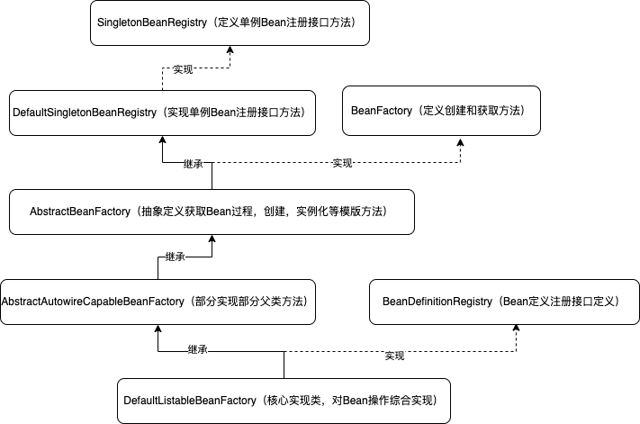
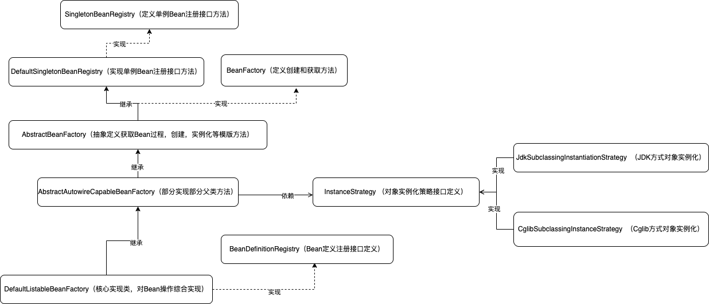
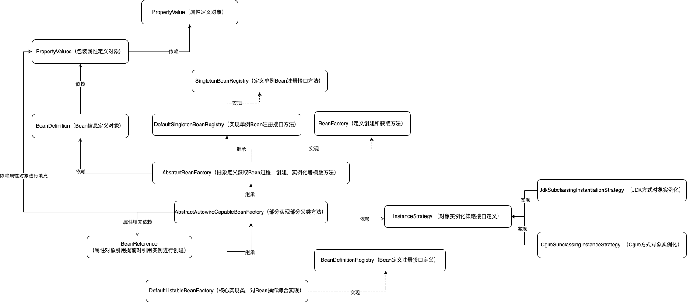
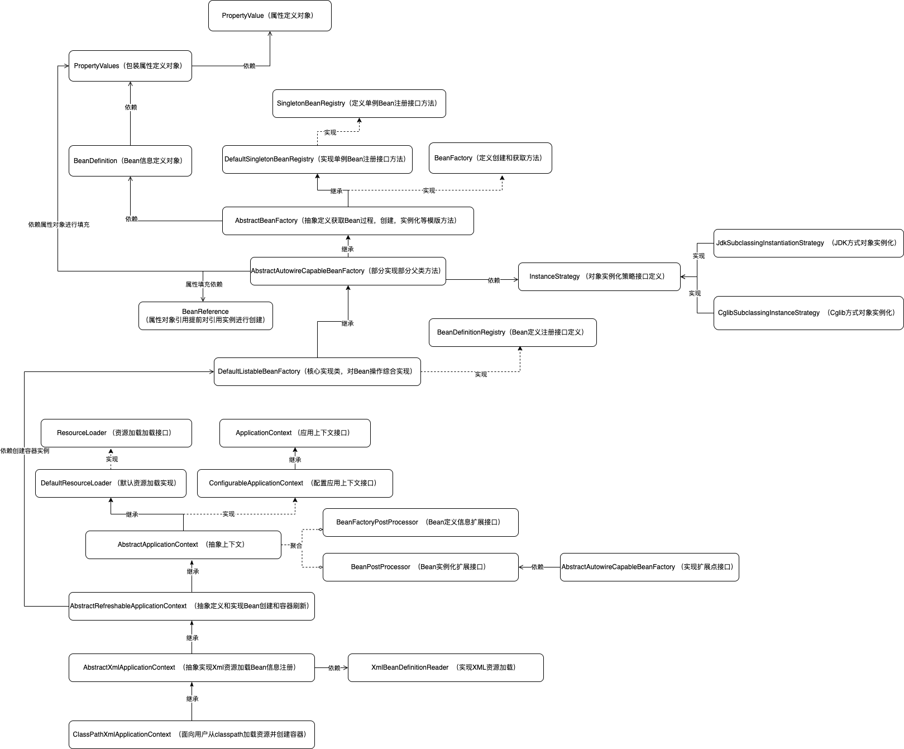
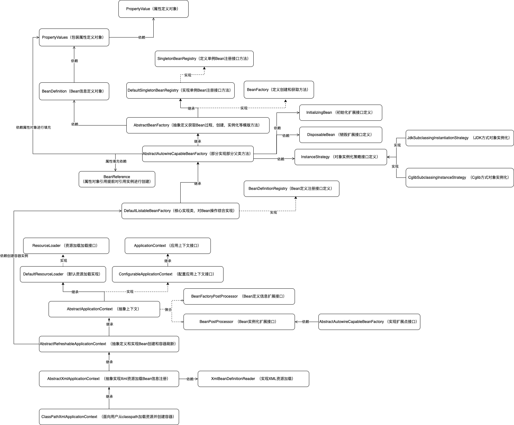
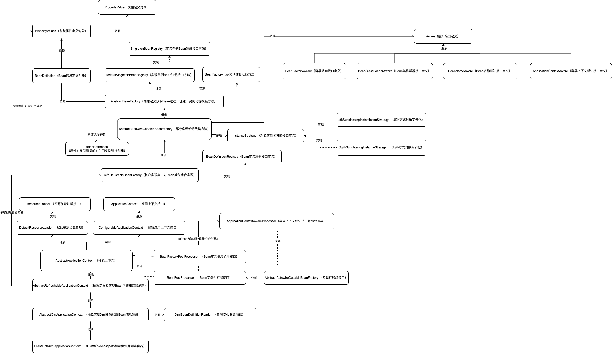
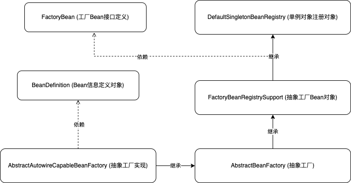

# smart-spring
🌱 本项目以Spring 源码学习为目的，了解 Spring 核心原理，对IOC、AOP、Bean生命周期、上下文、作用域，扩展机制等特性研究学习！

### 目标：实现SpringBean的定义注册，Bean获取
+ 代码分支：feat-factory-init 
#### 代码结构图

### 目标：实现SpringBean的实例化策略
+ 代码分支：fix-factory-constructor-init
#### 代码结构图

### 目标：实现SpringBean的注入属性和依赖对象
+ 代码分支：feat_factory-properties
#### 代码结构图

### 目标：实现Spring的资源加载器解析文件注册对象
+ 代码分支：feat-factory-resource
#### 代码结构图

### 目标：实现Spring的应用上下文
+ 代码分支：feat-factory-context
#### 代码结构图

### 目标：实现Spring的应用上下文初始化和注销扩展实现
+ 代码分支：feat-factory-conext-init-destroy
#### 代码结构图

### 目标：实现Spring的Aware感知接口
+ 代码分支：feat-factory-aware
#### 代码结构图

### 目标：实现Spring的FactoryBean和作用域
+ 代码分支：feat-factory-bean
#### 代码结构图

